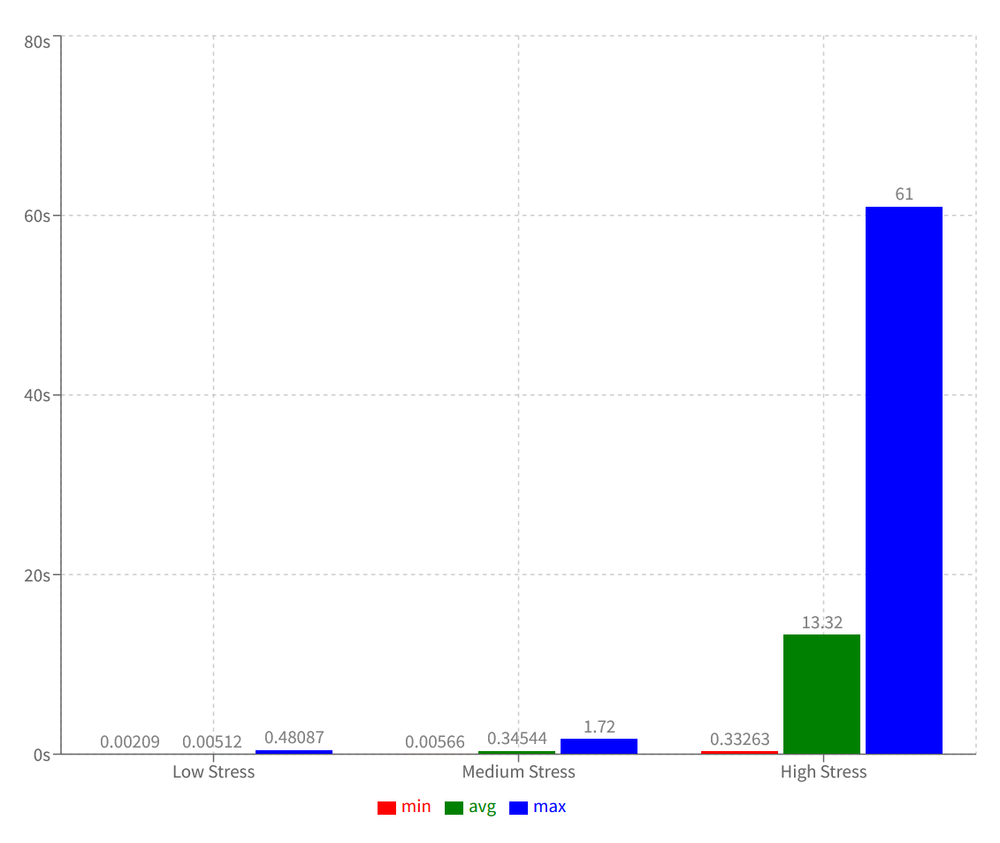
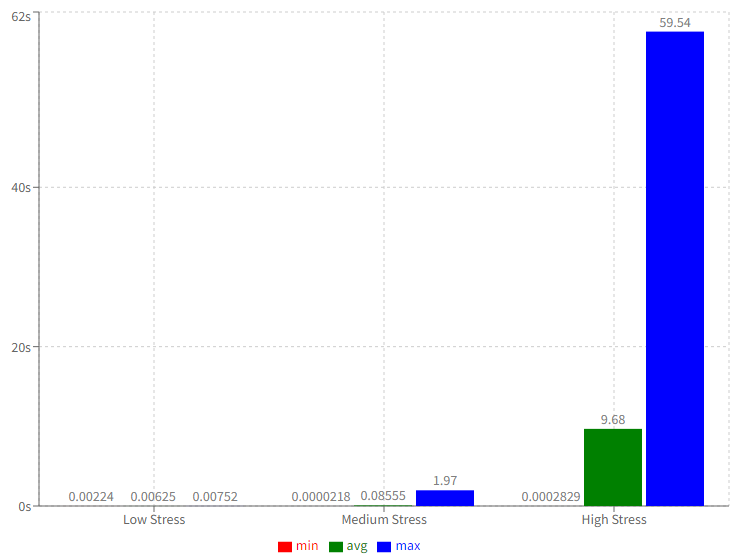

# mwro-ts

## Testes de carga:

### Fase E: 1a Medição dos Testes de Carga

#### Serviço 1: Sign-up de usuário:

Este serviço simula um usuário criando uma conta.

Todos os testes foram realizados num banco de dados limpo, sem qualquer tipo de dado anterior.

-   Tipo de operações: Leitura e Escrita
-   Arquivos envolvidos:
    -   src/routes/user.ts (roteamento)
    -   src/controllers/UserController.ts (controller)
    -   src/domains/user/sign-up/index.ts (lógica de domínio)
    -   src/infra/database/user/index.ts (acesso ao banco de dados)
-   Arquivos com o código fonte de medição do teste:

    -   stress-tests/1-medicao/sign-up/sign-up-test.js
    -   stress-tests/1-medicao/sign-up/high-stress.js
    -   stress-tests/1-medicao/sign-up/medium-stress.js
    -   stress-tests/1-medicao/sign-up/low-stress.js

    Além desses, na mesma pasta estão presentes arquivos em formato .md com os resultados dos testes.

-   Descrição das configurações:

    Todos os testes foram realizados utilizando contâineres Docker.

    A API utilizou uma imagem criada a partir da imagem oficial do node, versão 20.

    O banco de dados utilizou a imagem oficial do postgres, versão versão 16.

    Ambos os contâineres foram executados localmente, numa máquina com processador Intel core I5 12400f, 32GB de RAM e armazenamento em um SSD NVME de 1 TB com velocidades de leitura de 2400MB/s e escrita de 1850MB/s. A máquina utiliza Windows 11 como sistema operacional principal, porém os contâineres foram executados dentro de um ambiente Linux (Ubuntu 24.04) através de WSL.

    Os testes foram realizados utilizando a ferramenta K6 da Grafana.

-   Testes de carga (SLA):

    -   Baixo stress:
        -   vazão (número médio de requisições por minuto): 10 usuários virtuais por segundo \* 60 segundos = 600 requisições/minuto
        -   latência (tempo médio de resposta):
            -   média: 6.18ms
            -   Outros valores: min=1.85ms med=3.83ms max=810.75ms p(90)=6.73ms p(95)=7.84ms
        -   concorrência (limite de requisições simultâneas):
            Não atingiu nenhum limite.
    -   Médio stress:
        -   vazão (número médio de requisições por minuto): 1000 usuários virtuais por segundo \* 60 segundos = 60.000 requisições/minuto
        -   latência (tempo médio de resposta):
            -   média: 86.62ms
            -   Outros valores: min=1.83ms med=63.28ms max=2.57s p(90)=168.2ms p(95)=217.3ms
        -   concorrência (limite de requisições simultâneas):
            Não atingiu nenhum limite.
    -   Alto stress: - vazão (número médio de requisições por minuto): 10000 usuários virtuais por segundo \* 60 segundos = 60.0000 requisições/minuto - latência (tempo médio de resposta): - média: 11.01s - Outros valores: min=827.47ms med=10.46s max=1m3s p(90)=12.99s p(95)=13.36s - concorrência (limite de requisições simultâneas): - De um total de 162138 requisições realizadas no teste, 0.03% (53 falharam). Isso significa que o sistema atingiu algum tipo de limite ao realizar 10.000 requisições simultâneas, porém não se sabe dizer ao certo o número limite apenas com os dados fornecidos pelo K6.

        

-   Potenciais gargalos:

    -   O endpoint realiza uma operação de leitura por string na coluna email da tabela users. Essa coluna atualmente não se encontra indexada. Isso é reforçado pelo fato de que a média do tempo de resposta é considerávelmente maior do que a mediana. Isso indica que as primeiras requisições não eram tão lentas, porém conforme a tabela foi sendo preenchida, as requisições foram tomando mais tempo. Um índice nesse campo poderia aumentar significativamente a performance do endpoint.

    -   O alto número de pedidos simultâneos pode ter sido impactado pelo limitado número de conexões disponíveis na pool de conexões com o banco de dados. Para os testes, utilizou-se o número padrão de conexões da biblioteca pg-pool (10). Ao atingir o número máximo de conexões em uso, as requisições precisavam esperar até que o banco estabelecesse novas conexões com o servidor (um processo custoso). Utilizar um número maior de conexões em aberto na pool poderia aumentar significativamente a performance do endpoint.

    -   Aumentar o número de conexões com o banco, apesar de ser um experimento fundamental, não é uma abordagem bala-de-prata, visto que cada conexão em aberto consome recursos do banco de dados. Dessa forma, não se pode aumentar as conexões indefinidamente, visto que recursos do banco passarão a ser utilizados para manter as conexões, deixando então de serem utilizados para suas funções principais. Uma outra abordagem para auxiliar nessa questão seria utilizar uma fila de processamento (RabbitMQ, por exemplo), de forma que a fila seria responsável por gerenciar os pedidos sendo recebidos e processando-os de forma gradual, sem sobrecarregar as conexões com o banco de dados.

    -   Apesar de haver uma operação de leitura envolvida no serviço, ela não traria benefícios em relação à performance, visto que a busca pelo e-mail seria (idealmente) sempre um miss no cache, sendo necessário realizar a busca no banco de qualquer forma.

#### Serviço 2: Buscar produto:

Este serviço simula um usuário fazendo login e buscando um produto.

Todos os testes foram realizados num banco de dados com 68.787 produtos e 1 usuário cadastrado.

A busca pelo produto é realizada pelo nome do produto, e os produtos cadastrados possuem uma boa diversidade de nomes.

A escolha de qual nome será utilizada na busca é aleatória e decidida na execução do teste.

-   Tipo de operações: Leitura e Escrita
-   Arquivos envolvidos:
    -   src/routes/product.ts (roteamento)
    -   src/domains/user/sign-in/index.ts (lógica de domínio)
    -   src/controllers/ProductController.ts (controller)
    -   src/infra/database/user/index.ts (acesso ao banco de dados)
    -   src/infra/database/product/index.ts (acesso ao banco de dados)
-   Arquivos com o código fonte de medição do teste:

    -   stress-tests/1-medicao/search-product/search-product-test.js
    -   stress-tests/1-medicao/search-product/high-stress.js
    -   stress-tests/1-medicao/search-product/medium-stress.js
    -   stress-tests/1-medicao/search-product/low-stress.js

    Além desses, na mesma pasta estão presentes arquivos em formato .md com os resultados dos testes.

-   Descrição das configurações:

    Todos os testes foram realizados utilizando contâineres Docker.

    A API utilizou uma imagem criada a partir da imagem oficial do node, versão 20.

    O banco de dados utilizou a imagem oficial do postgres, versão versão 16.

    Ambos os contâineres foram executados localmente, numa máquina com processador Intel core I5 12400f, 32GB de RAM e armazenamento em um SSD NVME de 1 TB com velocidades de leitura de 2400MB/s e escrita de 1850MB/s. A máquina utiliza Windows 11 como sistema operacional principal, porém os contâineres foram executados dentro de um ambiente Linux (Ubuntu 24.04) através de WSL.

    Os testes foram realizados utilizando a ferramenta K6 da Grafana.

-   Testes de carga (SLA):

    -   Baixo stress:
        -   vazão (número médio de requisições por minuto): 10 usuários virtuais por segundo \* 60 segundos = 600 requisições/minuto
        -   latência (tempo médio de resposta):
            -   média: 7.52ms
            -   Outros valores: min=2.24ms med=7.11ms max=37.74ms p(90)=9.5ms p(95)=11.02ms
        -   concorrência (limite de requisições simultâneas):
            Não atingiu nenhum limite.
    -   Médio stress:
        -   vazão (número médio de requisições por minuto): 1000 usuários virtuais por segundo \* 60 segundos = 60.000 requisições/minuto
        -   latência (tempo médio de resposta):
            -   média: 85.55ms
            -   Outros valores: min=21.8µs med=52.67ms max=1.97s p(90)=192.09ms p(95)=250.04ms
        -   concorrência (limite de requisições simultâneas):
            Não atingiu nenhum limite.
    -   Alto stress:
        -   vazão (número médio de requisições por minuto): 10000 usuários virtuais por segundo \* 60 segundos = 60.0000 requisições/minuto
        -   latência (tempo médio de resposta):
            -   média: 9.68s
            -   Outros valores: min=282.9ms med=9.4s max=59.54s p(90)=10.49s p(95)=10.73s
        -   concorrência (limite de requisições simultâneas):
            -   De um total de 170389 requisições realizadas no teste, 0.99% (1697) falharam. Isso significa que o sistema atingiu algum tipo de limite ao realizar 10.000 requisições simultâneas, porém não se sabe dizer ao certo o número limite apenas com os dados fornecidos pelo K6.

    

-   Potenciais gargalos:

    -   Uma camada de cache poderia aumentar significativamente a performance desse serviço. Ela permitira que buscas frequentes pudessem não passar por um acesso ao banco. Isso pouparia uso de conexões do banco, pouparia recursos de processamento e memória do banco e diminuiria o tempo de resposta geral por não precisar fazer o acesso ao banco.

    -   O endpoint realiza uma operação de leitura por string na coluna email da tabela users, além de uma busca por string na coluna name da tabela products. Essas colunas atualmente não se encontram indexadas.

    -   O alto número de pedidos simultâneos pode ter sido impactado pelo limitado número de conexões disponíveis na pool de conexões com o banco de dados. Para os testes, utilizou-se o número padrão de conexões da biblioteca pg-pool (10). Ao atingir o número máximo de conexões em uso, as requisições precisavam esperar até que o banco estabelecesse novas conexões com o servidor (um processo custoso). Utilizar um número maior de conexões em aberto na pool poderia aumentar significativamente a performance do endpoint.

    -   Aumentar o número de conexões com o banco, apesar de ser um experimento fundamental, não é uma abordagem bala-de-prata, visto que cada conexão em aberto consome recursos do banco de dados. Dessa forma, não se pode aumentar as conexões indefinidamente, visto que recursos do banco passarão a ser utilizados para manter as conexões, deixando então de serem utilizados para suas funções principais. Uma outra abordagem para auxiliar nessa questão seria utilizar uma fila de processamento (RabbitMQ, por exemplo), de forma que a fila seria responsável por gerenciar os pedidos sendo recebidos e processando-os de forma gradual, sem sobrecarregar as conexões com o banco de dados.

## Available pnpm Commands

### Generating Migrations

```sh
pnpm migration:generate
```

Compares the schema present on your schema snapshot on drizzle folder to the schemas present on src/database/schema. If it finds any difference, generates a migration for these changes.

If you run this command, be sure to check the generated migration SQL.

By itself, this command does not alter the database in any way.

### Deleting migrations

```sh
pnpm migration:drop
```

Deletes a migration on your drizzle folder, and also undoes the changes made from this migration on the snapshot folder.

By itself, this command does not alter the database in any way.

### Running Migrations

```sh
docker exec mwro_api_container pnpm migration:run
```

Runs all migrations that have not been executed against the database yet. It knows this by checking the drizzle schema and running a SELECT statement on the \_\_drizzle_migrations table.

This will perform changes to your database if there are any migrations to be ran.

## Testing

For testing, you will need an existing postgres container prepared to be used by the integration tests.

To create this container, run:

```sh
sh devops/generate-test-container.sh
```

You only need to run this command once. After this, you may reuse the container as many times as you wish.

With the container ready, you may now run the following to run the test suites:

```sh
sh devops/run-tests.sh
```
